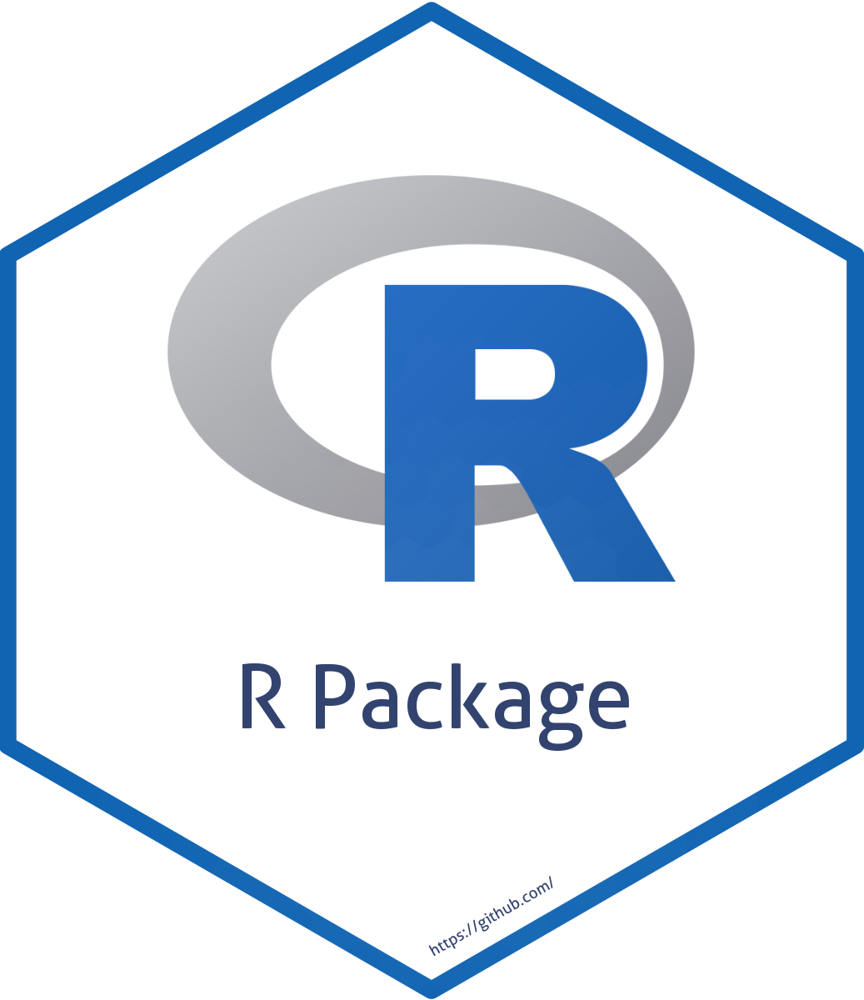

<!-- README.md is generated from README.Rmd. Please edit that file -->


```{r, include = FALSE}
knitr::opts_chunk$set(collapse  = TRUE,
                      comment   = "#>",
                      fig.path  = "man/figures/",
                      out.width = "100%")
```


hackathon.vn 
=========================================================

<!-- badges: start -->
[](https://CRAN.R-project.org/package=hackathon.vn)
[](https://github.com/Vigie-Nature/hackathon.vn/actions/workflows/R-CMD-check.yaml)
[](https://github.com/Vigie-Nature/hackathon.vn/actions/workflows/pkgdown.yaml)
[](https://github.com/Vigie-Nature/hackathon.vn/actions/workflows/test-coverage.yaml)
[](https://codecov.io/gh/Vigie-Nature/hackathon.vn)
[](https://choosealicense.com/licenses/gpl-2.0/)
<!-- badges: end -->


<p align="left">
  • <a href="#overview">Overview</a><br>
  • <a href="#features">Features</a><br>
  • <a href="#installation">Installation</a><br>
  • <a href="#get-started">Get started</a><br>
  • <a href="#long-form-documentations">Long-form documentations</a><br>
  • <a href="#citation">Citation</a><br>
  • <a href="#contributing">Contributing</a><br>
  • <a href="#acknowledgments">Acknowledgments</a><br>
  • <a href="#references">References</a>
</p>


## Overview


The R package `hackathon.vn`... **{{ DESCRIBE YOUR PACKAGE }}**


## Features

The main purpose of `hackathon.vn` is to... **{{ DESCRIBE THE MAIN FEATURES }}**


## Installation

You can install the development version from [GitHub](https://github.com/) with:

```{r eval=FALSE}
## Install < remotes > package (if not already installed) ----
if (!requireNamespace("remotes", quietly = TRUE)) {
  install.packages("remotes")
}

## Install < hackathon.vn > from GitHub ----
remotes::install_github("Vigie-Nature/hackathon.vn")
```

Then you can attach the package `hackathon.vn`:

```{r eval=FALSE}
library("hackathon.vn")
```


## Get started

For an overview of the main features of `hackathon.vn`, please read the 
[Get started](https://Vigie-Nature.github.io/hackathon.vn/articles/hackathon.vn.html)
vignette.


## Long-form documentations

`hackathon.vn` provides **{{ NUMBER OF VIGNETTES }}** vignettes to learn more about the package:

- the [Get started](https://Vigie-Nature.github.io/hackathon.vn/articles/hackathon.vn.html)
vignette describes the core features of the package
- **{{ LIST ADDITIONAL VIGNETTES }}**


## Citation

Please cite `hackathon.vn` as: 

> Pretet Mael (`r format(Sys.Date(), "%Y")`) hackathon.vn: An R 
package to **{{ TITLE }}**. R package version 0.0.0.9000. 
<https://github.com/Vigie-Nature/hackathon.vn/>


## Contributing

All types of contributions are encouraged and valued. For more information, 
check out our [Contributor Guidelines](https://github.com/Vigie-Nature/hackathon.vn/blob/main/CONTRIBUTING.md).

Please note that the `hackathon.vn` project is released with a 
[Contributor Code of Conduct](https://contributor-covenant.org/version/2/1/CODE_OF_CONDUCT.html). 
By contributing to this project, you agree to abide by its terms.


## Acknowledgments

**{{ OPTIONAL SECTION }}**


## References

**{{ OPTIONAL SECTION }}**
